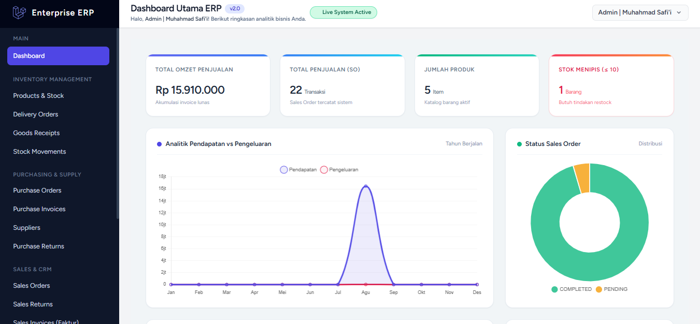
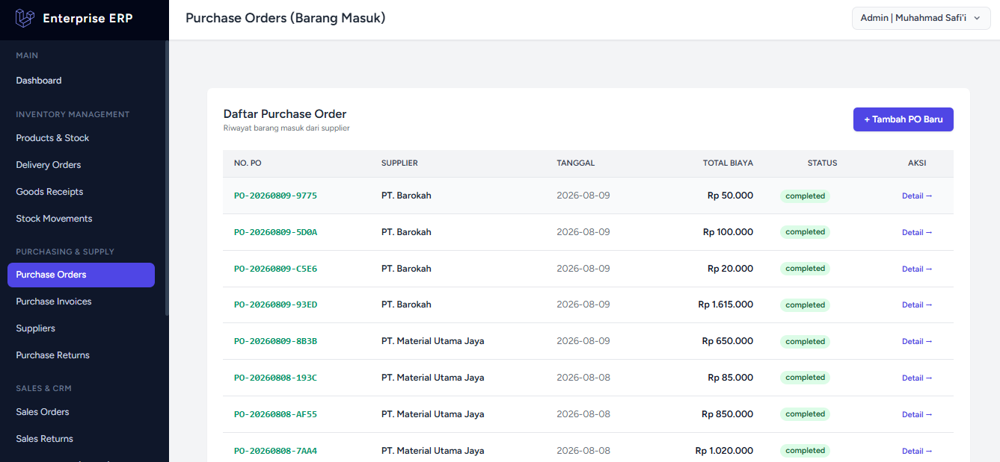
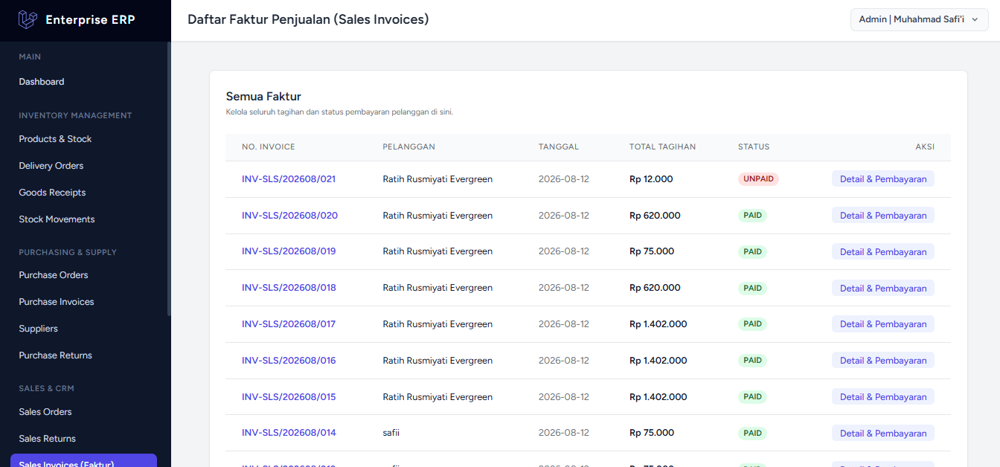
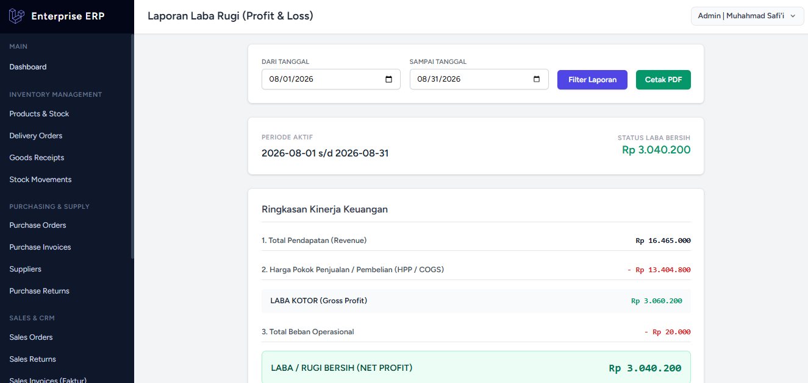
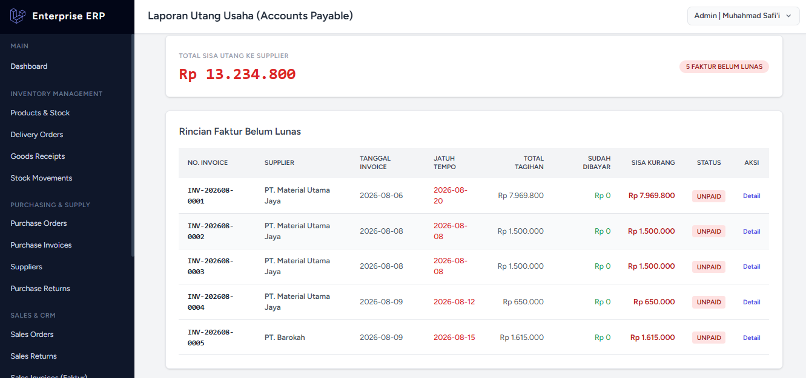

# Enterprise ERP

Aplikasi Enterprise Resource Planning (ERP) berbasis Laravel yang dirancang untuk membantu pengelolaan proses bisnis secara terintegrasi.

## Demo Aplikasi

Berikut merupakan beberapa tampilan halaman dari aplikasi yang telah dikembangkan.

## Dashboard

Dashboard digunakan untuk menampilkan ringkasan informasi utama dari sistem sehingga pengguna dapat melihat kondisi dan aktivitas bisnis secara lebih mudah.

## Product & Stock

Halaman Product & Stock digunakan untuk mengelola data produk serta memantau informasi stok yang tersedia dalam sistem.

## Purchase Order

Halaman Purchase Order digunakan untuk mengelola proses pemesanan barang dari supplier.

## Detail Purchase

Halaman Detail Purchase menampilkan informasi lebih lengkap mengenai transaksi pembelian, termasuk detail barang dan informasi transaksi.

## Sales Invoice

Halaman Sales Invoice digunakan untuk mengelola dan menampilkan transaksi penjualan yang telah dibuat dalam sistem.

## Detail Sales Invoice

Halaman Detail Sales Invoice menampilkan informasi lengkap mengenai transaksi penjualan dan item yang terdapat di dalam invoice.

## Laporan Laba Rugi

Halaman Laporan Laba Rugi digunakan untuk menampilkan informasi pendapatan, biaya, serta hasil laba atau rugi berdasarkan transaksi yang terdapat dalam sistem.

## Laporan Utang

Halaman Laporan Utang digunakan untuk membantu memantau informasi kewajiban atau utang yang terdapat dalam sistem.

## Teknologi

- Laravel
- PHP
- JavaScript 
- MySQL
- Tailwind CSS

---

## Catatan

Screenshot di atas merupakan dokumentasi tampilan aplikasi dan digunakan sebagai demo hasil pengembangan. Aplikasi ini akan terus dikembang kan secara matang sebagai mana mestinya sebuah aplikasi erp.
